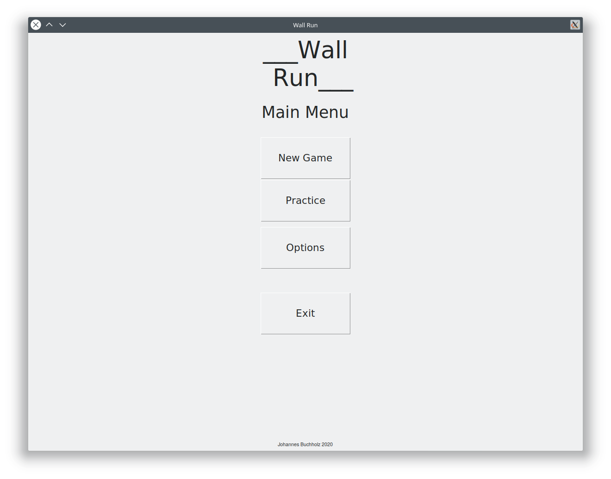
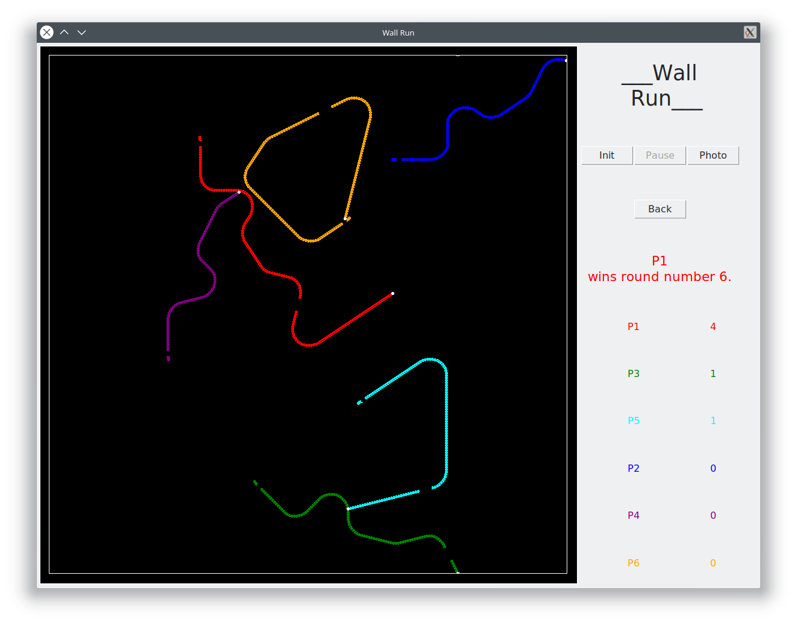
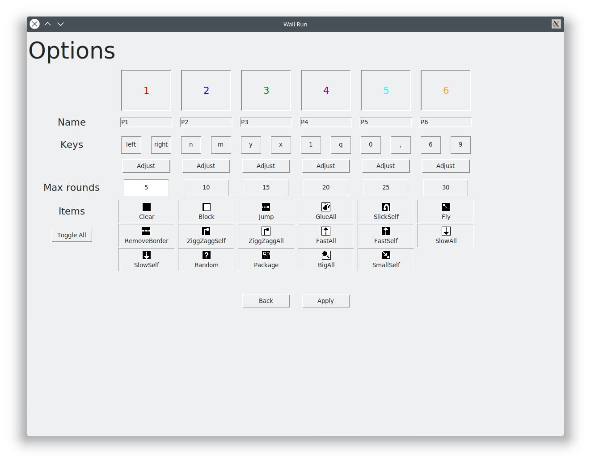

# Wall Run

This is a simple game written in Python 3 for up to six players - playable on one single keyboard.
This project was inspired by the well known game "AchtungDieKurve".





# How to install

1. Clone this repository.
2. Create a virtual environment inside the repository and activate it.
3. Install teh required packages provided within the `requirements.txt` file by running
    ```bash
    pip3 install -r requirements.txt
    ```
   inside your virtual environments
4. Start the programm by running
    ```bash
    python3 __main__.py
    ```
   or
    ```bash
    python3 /<absolute path to direcory>/WallRun
    ```

## Required Packages

In order to run this game you need the following packages:

- numpy (>=1.19.1)
- pynput (>=1.6.8)

After cloning this repository, use the `requirements.txt` file to install the above libraries into your virtual
environment.
